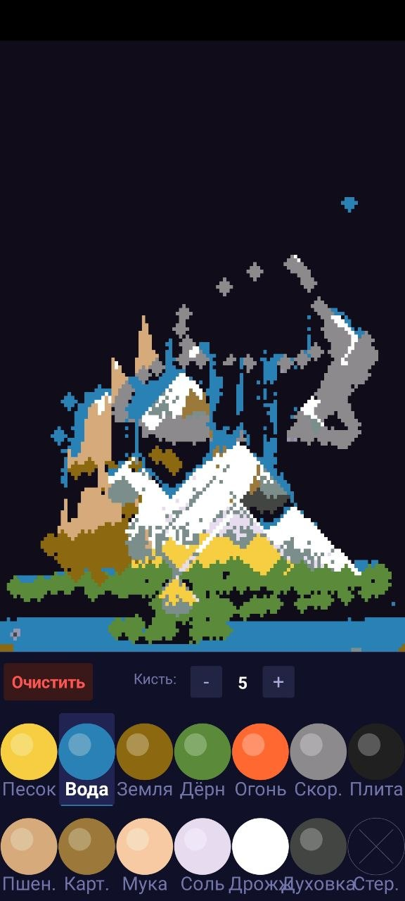

<div align="center">

# 🧪 TinyAPK Lab

### Ultra-light Android projects, hand-built APK pipelines, and kilobyte-scale experiments
### Ультралёгкие Android-проекты, ручная сборка APK и эксперименты в масштабе килобайт

---


</div>

---

## 📖 Overview / Обзор

**TinyAPK Lab** is a curated repository of minimal Android projects built with pure Java and platform SDK APIs - without Gradle, AndroidX, Kotlin, or heavyweight tooling. The goal is straightforward: show how small, understandable, and portable a real Android app can be when the stack stays lean.

**TinyAPK Lab** - это аккуратно собранный репозиторий минималистичных Android-проектов на чистом Java и API платформы Android SDK, без Gradle, AndroidX, Kotlin и тяжёлой инфраструктуры. Цель простая: показать, насколько маленьким, понятным и переносимым может быть реальное Android-приложение при аккуратном стеке.

---

## ✨ Highlights / Главное

| | English | Русский |
|---|---|---|
| 🔧 | Pure Java, `SurfaceView`, `Canvas`, and manual APK packaging | Чистый Java, `SurfaceView`, `Canvas` и ручная упаковка APK |
| 🚫 | No Gradle, no mandatory Android Studio, no AndroidX, no game engine | Без Gradle, без обязательного Android Studio, без AndroidX, без игровых движков |
| 📦 | Ready-to-install build artifacts included in the repo | Готовые артефакты сборки уже лежат в репозитории |
| 🪶 | Release APKs stay in the **~16.8 KB** range instead of multi-megabyte | Release APK остаются на уровне **~16.8 KB** вместо привычных мегабайт |

---

## 🎮 Projects / Проекты

| Project | What it includes | Build output |
|---|---|---|
| [🟦 Tetris][tetris-readme] | Swipe-based classic Tetris with 7 tetrominoes, ghost piece, wall kick, scoring, levels, and next-piece preview.<br>Классический Tetris со свайп-управлением, 7 тетромино, ghost piece, wall kick, очками, уровнями и preview следующей фигуры. | `Tetris.apk` - 16,811 bytes<br>`Tetris-release.apk` - 16,811 bytes |
| [🏖️ Sandbox][sandbox-readme] | Falling-sand sandbox with powders, water, seeds, heat, steam, simple farming, and cooking reactions.<br>Песочница с порошками, водой, семенами, жаром, паром, простым выращиванием и кулинарными реакциями. | `Sandbox.apk` - 20,907 bytes<br>`Sandbox-release.apk` - 16,811 bytes |
| [📘 Build Guides][build-guides] | Manual build notes for `aapt2 -> ecj -> d8/R8 -> zipalign -> apksigner`, plus R8 shrinking guidance.<br>Гайды по ручной сборке через `aapt2 -> ecj -> d8/R8 -> zipalign -> apksigner` и заметки по R8. | Documentation / Документация |

---

## 📸 Screenshots / Скриншоты

<table>
  <tr>
    <td align="center">
      <a href="./Tetris%20-%2016%D0%BA%D0%B1%20%D0%B2%D0%B5%D1%81/README.md">
        
      </a>
    </td>
    <td align="center">
      <a href="./Sandbox%20-%2016-20%D0%BA%D0%B1%20%D0%B2%D0%B5%D1%81/README.md">
        
      </a>
    </td>
  </tr>
  <tr>
    <td align="center"><strong>🟦 Tetris</strong><br>Minimal UI, ghost piece, scoring, and level flow.</td>
    <td align="center"><strong>🏖️ Sandbox</strong><br>Particles, heat, farming, and cooking.</td>
  </tr>
</table>

---

## 🤔 Why This Repository Exists / Зачем нужен этот репозиторий

This repository documents a deliberately minimal Android workflow: small apps, transparent code, and a build chain that can run without the usual Gradle ecosystem. It works both as a reference and as a proof of concept for ultra-light mobile prototypes.

Этот репозиторий фиксирует намеренно минималистичный процесс разработки и сборки под Android: небольшие приложения, прозрачный код и сборочную цепочку, которую можно запускать без привычной экосистемы Gradle. Это и справочник, и proof of concept для ультралёгких мобильных прототипов.

---

## 🛠️ Tech Stack / Стек

```text
Java 8               - язык / language
Android SDK APIs     - платформа / platform
SurfaceView + Canvas - рендеринг / rendering
aapt2 -> ecj -> d8/R8 -> zipalign -> apksigner - сборочная цепочка / build chain
```

**Not used / Не используется:** Gradle, Kotlin, AndroidX, external UI/game frameworks.

---

## 📂 Repository Structure / Структура

```text
.
├── README.md
├── PROGUARD_README.md
├── LICENSE
├── LICENSE.ru.md
├── THIRD_PARTY_TOOLS.md
├── docs/
│   └── images/
│       ├── sandbox-shot-v2.jpg
│       └── tetris-shot-v2.jpg
├── билд апк/
│   ├── README.md
│   ├── SKILL.md
│   ├── прогуард/
│   │   └── SKILL.md
│   └── тетрис/
│       └── SKILL.md
├── Sandbox - 16-20кб вес/
│   ├── README.md
│   └── build/
└── Tetris - 16кб вес/
    ├── README.md
    └── build/
```

---

## 🔗 Quick Links / Быстрые ссылки

| | Link |
|---|---|
| 🟦 | [Tetris project][tetris-readme] |
| 🏖️ | [Sandbox project][sandbox-readme] |
| 📘 | [Manual build notes][build-guides] |
| 🔒 | [R8 / ProGuard guide][r8-guide] |
| ⚖️ | [Third-party tools notice][third-party-tools] |
| 📄 | [MIT License (EN)][license-en] |
| 📄 | [MIT License (RU)][license-ru] |

---

## 📜 License / Лицензия

The original code and documentation in this repository are released under the **MIT License**. A separate tooling notice clarifies that these projects may be used together with Android SDK and build tools, but those third-party tools remain under their own licenses.

Оригинальный код и документация в этом репозитории распространяются по лицензии **MIT**. Отдельное уведомление поясняет, что проекты можно использовать вместе с Android SDK и build tools, но сами сторонние инструменты остаются под своими собственными лицензиями.

[tetris-readme]: ./Tetris%20-%2016%D0%BA%D0%B1%20%D0%B2%D0%B5%D1%81/README.md
[sandbox-readme]: ./Sandbox%20-%2016-20%D0%BA%D0%B1%20%D0%B2%D0%B5%D1%81/README.md
[build-guides]: ./%D0%B1%D0%B8%D0%BB%D0%B4%20%D0%B0%D0%BF%D0%BA/README.md
[r8-guide]: ./PROGUARD_README.md
[third-party-tools]: ./THIRD_PARTY_TOOLS.md
[license-en]: ./LICENSE
[license-ru]: ./LICENSE.ru.md
