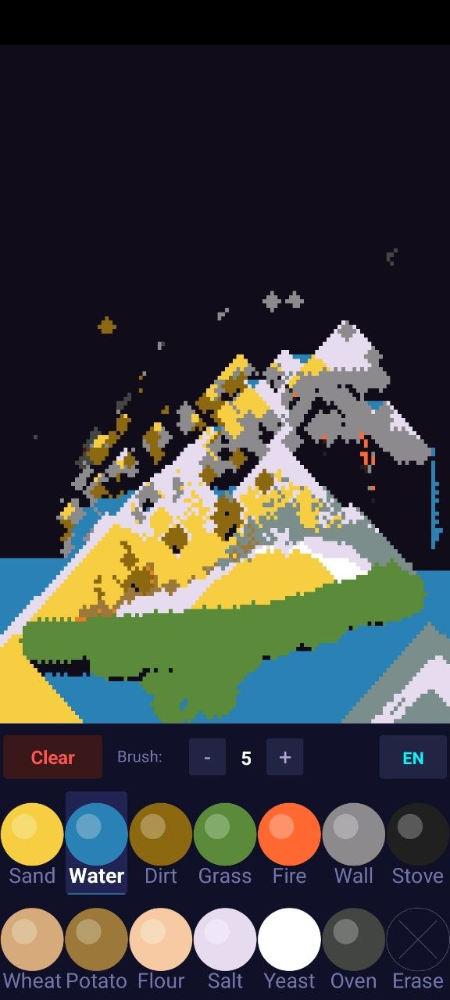
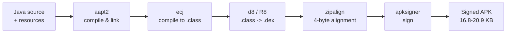

<div align="center">


# TinyAPK Lab

**Real Android apps, hand-built APKs, kilobyte-scale.**

Pure Java · Android SDK · No Gradle · No AndroidX · No Kotlin

[**English**](README.md) · [Русский](README.ru.md) · [Quick start](#-quick-start) · [Projects](#-projects) · [Build chain](#-build-chain) · [Structure](#-repository-structure)

<br>

        

   

<br><br>

<table>
  <tr>
    <td align="center">
      <a href="./Tetris/README.md">
        
      </a>
    </td>
    <td align="center">
      <a href="./Sandbox/README.md">
        
      </a>
    </td>
  </tr>
</table>

*Two playable games. Two APKs under 21 KB. Zero build-system dependency.*

Built by a solo dev · assembled with five command-line tools

</div>

---

> [!NOTE]
> **No Gradle project inside.** These apps are compiled and packaged by hand: `aapt2 -> ecj -> d8/R8 -> zipalign -> apksigner`. There is no `build.gradle`, no Android Studio project, and no AndroidX — just Java source, the platform SDK, and a handful of command-line tools.

**TinyAPK Lab** is a small, curated collection of Android apps written in plain Java against the raw Android SDK APIs. No Gradle, no Kotlin, no AndroidX, no game engine — just `SurfaceView`, `Canvas`, and a build chain assembled entirely from command-line tools. The point is to show how small, transparent, and portable a real, installable Android app can be.

> [!TIP]
> **Release APKs stay under 21 KB.** An empty "Hello World" Android Studio project typically ships at 1.5–3 MB before a single line of logic is written. These apps are 70–150× smaller — and fully playable.

<table>
<tr>
<td width="33%" valign="top">

###  Pure Java, no bloat
`SurfaceView` + `Canvas` rendering, no game engine, no reflection-heavy frameworks — every line is readable.

</td>
<td width="33%" valign="top">

###  Hand-built pipeline
`aapt2 -> ecj -> d8/R8 -> zipalign -> apksigner` — the same chain Android Studio hides from you, run by hand.

</td>
<td width="33%" valign="top">

###  Kilobyte-scale APKs
Signed, installable release builds in the **16.8–20.9 KB** range are committed straight into the repo.

</td>
</tr>
</table>

---

## Contents

- [Quick start](#-quick-start)
- [Projects](#-projects)
- [Screenshots](#-screenshots)
- [Build chain](#-build-chain)
- [Tech stack](#-tech-stack)
- [Repository structure](#-repository-structure)
- [Why this exists](#-why-this-exists)
- [Documentation](#-documentation)
- [Principles](#-principles)
- [License](#-license)

---

##  Quick start

###  Option A — install a prebuilt APK

Every project already ships a signed release build in its `build/` folder:

```bash
adb install "Tetris/build/Tetris-release.apk"
adb install "Sandbox/build/Sandbox-release.apk"
```

###  Option B — build it yourself

No Gradle, no project to open in an IDE — just the platform build tools on your `PATH`:

```bash
aapt2 compile -o compiled/ res/**/*
aapt2 link -o app-unsigned.apk -I android.jar --manifest AndroidManifest.xml compiled/*.zip
ecj -d classes -classpath android.jar src/**/*.java
d8 --release --output . classes/**/*.class
zip -j app-unsigned.apk classes.dex
zipalign -f 4 app-unsigned.apk app-aligned.apk
apksigner sign --ks debug.keystore --out app-release.apk app-aligned.apk
```

Full, project-specific step-by-step notes live in [`manual-build/`][build-guides], including R8 shrinking guidance ([EN][r8-guide-en] / [RU][r8-guide-ru]).

---

##  Projects

| Project | What it includes | Build output |
| :--- | :--- | :--- |
|  **[Tetris][tetris-readme]** | Swipe-based classic Tetris — 7 tetrominoes, ghost piece, wall kick, scoring, levels, next-piece preview. | `Tetris.apk` — 16,811 B<br>`Tetris-release.apk` — 16,811 B |
|  **[Sandbox][sandbox-readme]** | Falling-sand simulation — powders, water, seeds, heat, steam, simple farming, cooking reactions. | `Sandbox.apk` — 20,907 B<br>`Sandbox-release.apk` — 16,811 B |
|  **[Build guides][build-guides]** | Manual build notes for `aapt2 -> ecj -> d8/R8 -> zipalign -> apksigner`, plus R8 shrinking guidance. | Documentation |

---

##  Screenshots

<table>
  <tr>
    <td align="center">
      <a href="./Tetris/README.md">
        
      </a>
      <br><strong>Tetris</strong><br>Minimal UI, ghost piece, scoring, level flow.
    </td>
    <td align="center">
      <a href="./Sandbox/README.md">
        
      </a>
      <br><strong>Sandbox</strong><br>Particles, heat, farming, cooking.
    </td>
  </tr>
</table>

---

##  Build chain


```mermaid
flowchart LR
    SRC["Java source<br/>+ resources"] --> AAPT["aapt2<br/>compile & link"]
    AAPT --> ECJ["ecj<br/>compile to .class"]
    ECJ --> D8["d8 / R8<br/>.class -> .dex"]
    D8 --> ZIP["zipalign<br/>4-byte alignment"]
    ZIP --> SIGN["apksigner<br/>sign"]
    SIGN --> APK["Signed APK<br/>16.8-20.9 KB"]
```

No Gradle daemon, no dependency resolution, no annotation processors — five tools, one direction, a fully inspectable output at every stage.

---

##  Tech stack

```text
Java 8                 — language
Android SDK APIs       — platform, no support libraries
SurfaceView + Canvas   — rendering, no game engine
aapt2 -> ecj -> d8/R8 -> zipalign -> apksigner  — build chain
```

**Deliberately not used:** Gradle, Kotlin, AndroidX/Jetpack, external UI or game frameworks, third-party dependencies.

---

##  Repository structure

```text
.
├── README.md                    # this file (English)
├── README.ru.md                 # Russian version
├── PROGUARD_README.md           # R8 / ProGuard shrinking guide (EN)
├── PROGUARD_README.ru.md        # R8 / ProGuard shrinking guide (RU)
├── LICENSE                      # MIT (EN)
├── LICENSE.ru.md                # MIT (RU)
├── THIRD_PARTY_TOOLS.md         # notice on Android SDK / build tools licenses (EN)
├── THIRD_PARTY_TOOLS.ru.md      # notice on Android SDK / build tools licenses (RU)
├── .github/
│   └── assets/
│       ├── banner.svg
│       ├── badges/
│       └── icons/
├── docs/
│   └── images/
│       ├── tetris-shot-v2.jpg
│       ├── sandbox_en.jpg
│       └── sandbox_ru.jpg
├── manual-build/                # manual build guides
│   ├── README.md
│   ├── SKILL.md
│   ├── proguard/SKILL.md
│   └── tetris/SKILL.md
├── tools/                        # platform build binaries & keystores
│   └── windows/
├── Tetris/
│   ├── README.md
│   ├── build.ps1
│   └── build/
└── Sandbox/
    ├── README.md
    ├── build.ps1
    └── build/
```

---

##  Why this exists

Most Android tutorials start with Gradle, AndroidX, and a few hundred megabytes of tooling before a single pixel is drawn. This repository goes the other way: how small, transparent, and dependency-free can a *real*, installable Android app get if you build it by hand, one tool at a time?

It works both as a reference for the manual `aapt2 -> d8 -> apksigner` pipeline and as a proof of concept that kilobyte-scale, Gradle-free Android apps are still entirely possible.

---

##  Documentation

| | |
| :--- | :--- |
|  [Tetris project][tetris-readme] | Gameplay, controls, and source layout |
|  [Sandbox project][sandbox-readme] | Particle rules, farming, and cooking mechanics |
|  [Manual build notes][build-guides] | Step-by-step `aapt2 -> ecj -> d8/R8 -> zipalign -> apksigner` |
|  [R8 / ProGuard guide][r8-guide] | Shrinking, obfuscation, and size-reduction notes |
|  [Third-party tools notice][third-party-tools] | Licensing notes for Android SDK / build tools |

---

##  Principles

- **Minimal by mandate.** If it needs Gradle, AndroidX, or a dependency manager, it doesn't belong here.
- **Transparent.** No obfuscated build magic — every step of the pipeline is a plain command you can run yourself.
- **Portable.** Builds from a terminal, with nothing more than the Android SDK command-line tools and a JDK.
- **Small by default.** Every release APK is committed to the repo so you can see exactly what "kilobyte-scale" means.

---

##  License

Original code and documentation are released under the **MIT License** ([EN][license-en] / [RU][license-ru]). A separate tooling notice ([EN][third-party-tools-en] / [RU][third-party-tools-ru]) clarifies that these projects are built using the Android SDK and platform build tools, which remain under their own respective licenses.

[tetris-readme]: ./Tetris/README.md
[sandbox-readme]: ./Sandbox/README.md
[build-guides]: ./manual-build/README.md
[r8-guide]: ./PROGUARD_README.md
[r8-guide-en]: ./PROGUARD_README.md
[r8-guide-ru]: ./PROGUARD_README.ru.md
[third-party-tools]: ./THIRD_PARTY_TOOLS.md
[third-party-tools-en]: ./THIRD_PARTY_TOOLS.md
[third-party-tools-ru]: ./THIRD_PARTY_TOOLS.ru.md
[license-en]: ./LICENSE
[license-ru]: ./LICENSE.ru.md

<div align="center">

**TinyAPK Lab** · real Android apps, kilobyte-scale

<sub>MIT License · See <a href="LICENSE">LICENSE</a> for details</sub>

</div>
