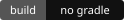
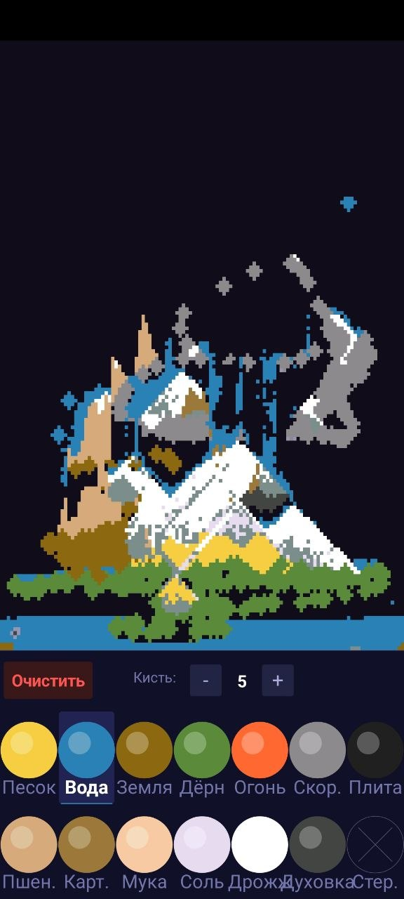
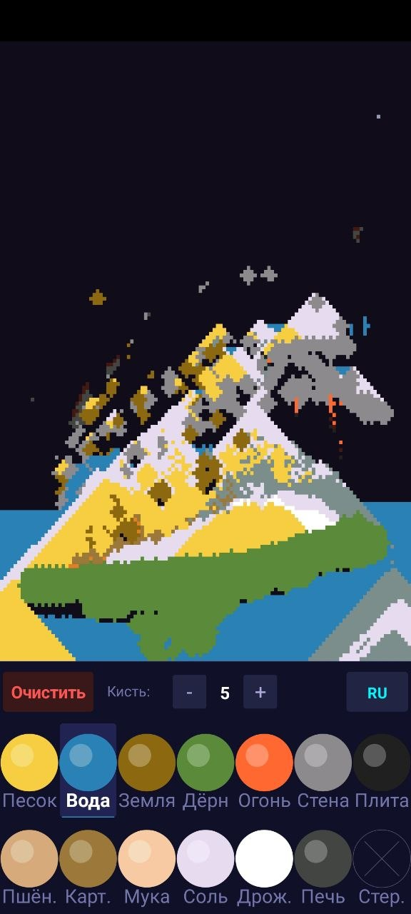
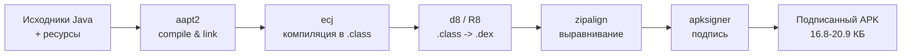

<div align="center">


# TinyAPK Lab

**Настоящие Android-приложения, собранные вручную, размером в килобайты.**

Чистый Java · Android SDK · Без Gradle · Без AndroidX · Без Kotlin

[English](README.md) · [**Русский**](README.ru.md) · [Быстрый старт](#-быстрый-старт) · [Проекты](#-проекты) · [Сборочная цепочка](#-сборочная-цепочка) · [Структура](#-структура-репозитория)

<br>

        

   

<br><br>

<table>
  <tr>
    <td align="center">
      <a href="./Tetris/README.md">
        
      </a>
    </td>
    <td align="center">
      <a href="./Sandbox/README.ru.md">
        
      </a>
    </td>
  </tr>
</table>

*Две играбельные игры. Два APK весом менее 21 КБ. Ноль зависимости от системы сборки.*

Сделано одним разработчиком · собрано пятью консольными инструментами

</div>

---

> [!NOTE]
> **Внутри нет проекта Gradle.** Эти приложения компилируются и упаковываются вручную: `aapt2 -> ecj -> d8/R8 -> zipalign -> apksigner`. Нет `build.gradle`, нет проекта Android Studio, нет AndroidX — только исходники на Java, платформенный SDK и несколько консольных утилит.

**TinyAPK Lab** — небольшая, аккуратно собранная коллекция Android-приложений, написанных на чистом Java поверх «сырых» API Android SDK. Без Gradle, без Kotlin, без AndroidX, без игровых движков — только `SurfaceView`, `Canvas` и сборочная цепочка, целиком состоящая из консольных инструментов. Смысл — показать, насколько маленьким, прозрачным и переносимым может быть настоящее, устанавливаемое Android-приложение.

> [!TIP]
> **Release-сборки укладываются в 21 КБ.** Пустой проект «Hello World» из Android Studio обычно весит 1.5–3 МБ ещё до того, как написана хоть одна строчка логики. Эти приложения в 70–150 раз меньше — и при этом полностью играбельны.

<table>
<tr>
<td width="33%" valign="top">

###  Чистый Java, без лишнего
Рендеринг через `SurfaceView` + `Canvas`, без игрового движка, без тяжёлых reflection-фреймворков — каждая строчка читаема.

</td>
<td width="33%" valign="top">

###  Ручная сборочная цепочка
`aapt2 -> ecj -> d8/R8 -> zipalign -> apksigner` — та же цепочка, что Android Studio прячет от вас, запущенная вручную.

</td>
<td width="33%" valign="top">

###  APK в масштабе килобайт
Подписанные, устанавливаемые release-сборки размером **16.8–20.9 КБ** лежат прямо в репозитории.

</td>
</tr>
</table>

---

## Содержание

- [Быстрый старт](#-быстрый-старт)
- [Проекты](#-проекты)
- [Скриншоты](#-скриншоты)
- [Сборочная цепочка](#-сборочная-цепочка)
- [Стек технологий](#-стек-технологий)
- [Структура репозитория](#-структура-репозитория)
- [Зачем это нужно](#-зачем-это-нужно)
- [Документация](#-документация)
- [Принципы](#-принципы)
- [Лицензия](#-лицензия)

---

##  Быстрый старт

###  Вариант A — установить готовый APK

В каждом проекте уже есть подписанная release-сборка в папке `build/`:

```bash
adb install "Tetris/build/Tetris-release.apk"
adb install "Sandbox/build/Sandbox-release.apk"
```

###  Вариант B — собрать самостоятельно

Без Gradle, без проекта для открытия в IDE — нужны только инструменты сборки платформы в PATH:

```bash
aapt2 compile -o compiled/ res/**/*
aapt2 link -o app-unsigned.apk -I android.jar --manifest AndroidManifest.xml compiled/*.zip
ecj -d classes -classpath android.jar src/**/*.java
d8 --release --output . classes/**/*.class
zip -j app-unsigned.apk classes.dex
zipalign -f 4 app-unsigned.apk app-aligned.apk
apksigner sign --ks debug.keystore --out app-release.apk app-aligned.apk
```

Полные пошаговые заметки по каждому проекту — в [`manual-build/`][build-guides], включая гайд по R8-сжатию ([EN][r8-guide-en] / [RU][r8-guide-ru]).

---

##  Проекты

| Проект | Что внутри | Артефакты сборки |
| :--- | :--- | :--- |
|  **[Tetris][tetris-readme]** | Классический Tetris со свайп-управлением — 7 тетромино, ghost piece, wall kick, очки, уровни, превью следующей фигуры. | `Tetris.apk` — 16 811 Б<br>`Tetris-release.apk` — 16 811 Б |
|  **[Sandbox][sandbox-readme]** | Песочница с падающим песком — порошки, вода, семена, жар, пар, простое выращивание, кулинарные реакции. | `Sandbox.apk` — 20 907 Б<br>`Sandbox-release.apk` — 16 811 Б |
|  **[Гайды по сборке][build-guides]** | Заметки по ручной сборке через `aapt2 -> ecj -> d8/R8 -> zipalign -> apksigner`, плюс рекомендации по R8. | Документация |

---

##  Скриншоты

<table>
  <tr>
    <td align="center">
      <a href="./Tetris/README.md">
        
      </a>
      <br><strong>Tetris</strong><br>Минималистичный UI, ghost piece, очки, уровни.
    </td>
    <td align="center">
      <a href="./Sandbox/README.ru.md">
        
      </a>
      <br><strong>Sandbox</strong><br>Частицы, жар, выращивание, готовка.
    </td>
  </tr>
</table>

---

##  Сборочная цепочка



Никакого демона Gradle, разрешения зависимостей или annotation processor'ов — пять инструментов, одно направление, полностью проверяемый результат на каждом шаге.

---

##  Стек технологий

```text
Java 8                 — язык
Android SDK APIs       — платформа, без support-библиотек
SurfaceView + Canvas   — рендеринг, без игрового движка
aapt2 -> ecj -> d8/R8 -> zipalign -> apksigner  — сборочная цепочка
```

**Намеренно не используется:** Gradle, Kotlin, AndroidX/Jetpack, сторонние UI- или игровые фреймворки, внешние зависимости.

---

##  Структура репозитория

```text
.
├── README.md                    # этот файл (English)
├── README.ru.md                 # русская версия
├── PROGUARD_README.md           # гайд по R8 / ProGuard (EN)
├── PROGUARD_README.ru.md        # гайд по R8 / ProGuard (RU)
├── LICENSE                      # MIT (EN)
├── LICENSE.ru.md                # MIT (RU)
├── THIRD_PARTY_TOOLS.md         # уведомление о лицензиях Android SDK / build tools (EN)
├── THIRD_PARTY_TOOLS.ru.md      # уведомление о лицензиях Android SDK / build tools (RU)
├── .github/
│   └── assets/
│       ├── banner.svg
│       ├── badges/
│       └── icons/
├── docs/
│   └── images/
│       ├── tetris-shot-v2.jpg
│       ├── sandbox_en.jpg
│       └── sandbox_ru.jpg
├── manual-build/                # гайды по ручной сборке
│   ├── README.md
│   ├── SKILL.md
│   ├── proguard/SKILL.md
│   └── tetris/SKILL.md
├── tools/                        # бинарники сборки и keystore-файлы
│   └── windows/
├── Tetris/
│   ├── README.md
│   ├── build.ps1
│   └── build/
└── Sandbox/
    ├── README.md
    ├── build.ps1
    └── build/
```

---

##  Зачем это нужно

Большинство туториалов по Android начинаются с Gradle, AndroidX и пары сотен мегабайт инфраструктуры ещё до того, как отрисован хоть один пиксель. Этот репозиторий идёт в обратную сторону: насколько маленьким, прозрачным и свободным от зависимостей может быть настоящее, устанавливаемое Android-приложение, если собирать его вручную, инструмент за инструментом?

Это одновременно и справочник по ручной цепочке `aapt2 -> d8 -> apksigner`, и proof of concept того, что Android-приложения в масштабе килобайт без Gradle всё ещё вполне реальны.

---

##  Документация

| | |
| :--- | :--- |
|  [Проект Tetris][tetris-readme] | Геймплей, управление, структура исходников |
|  [Проект Sandbox][sandbox-readme] | Правила частиц, выращивание, механика готовки |
|  [Гайды по ручной сборке][build-guides] | Пошагово: `aapt2 -> ecj -> d8/R8 -> zipalign -> apksigner` |
|  [Гайд по R8 / ProGuard][r8-guide-ru] | Сжатие, обфускация, уменьшение размера |
|  [Уведомление о сторонних инструментах][third-party-tools-ru] | Заметки о лицензиях Android SDK / build tools |

---

##  Принципы

- **Минимализм по умолчанию.** Если для чего-то нужен Gradle, AndroidX или менеджер зависимостей — этому не место здесь.
- **Прозрачность.** Никакой скрытой магии сборки — каждый шаг цепочки это обычная команда, которую можно запустить самому.
- **Переносимость.** Сборка из терминала, без ничего лишнего, кроме консольных инструментов Android SDK и JDK.
- **Малый размер по умолчанию.** Каждая release-сборка коммитится в репозиторий, чтобы было видно, что реально значит «масштаб килобайт».

---

##  Лицензия

Оригинальный код и документация распространяются под лицензией MIT ([EN][license-en] / [RU][license-ru]). Отдельное уведомление об инструментах ([EN][third-party-tools-en] / [RU][third-party-tools-ru]) поясняет, что проекты собираются с помощью Android SDK и build tools, которые остаются под своими собственными лицензиями.

[tetris-readme]: ./Tetris/README.md
[sandbox-readme]: ./Sandbox/README.md
[build-guides]: ./manual-build/README.ru.md
[build-guides-en]: ./manual-build/README.md
[build-guides-ru]: ./manual-build/README.ru.md
[r8-guide]: ./PROGUARD_README.ru.md
[r8-guide-en]: ./PROGUARD_README.md
[r8-guide-ru]: ./PROGUARD_README.ru.md
[third-party-tools]: ./THIRD_PARTY_TOOLS.ru.md
[third-party-tools-en]: ./THIRD_PARTY_TOOLS.md
[third-party-tools-ru]: ./THIRD_PARTY_TOOLS.ru.md
[license-en]: ./LICENSE
[license-ru]: ./LICENSE.ru.md

<div align="center">

**TinyAPK Lab** · настоящие Android-приложения в масштабе килобайт

<sub>Лицензия MIT · подробности в <a href="LICENSE.ru.md">LICENSE.ru.md</a></sub>

</div>
